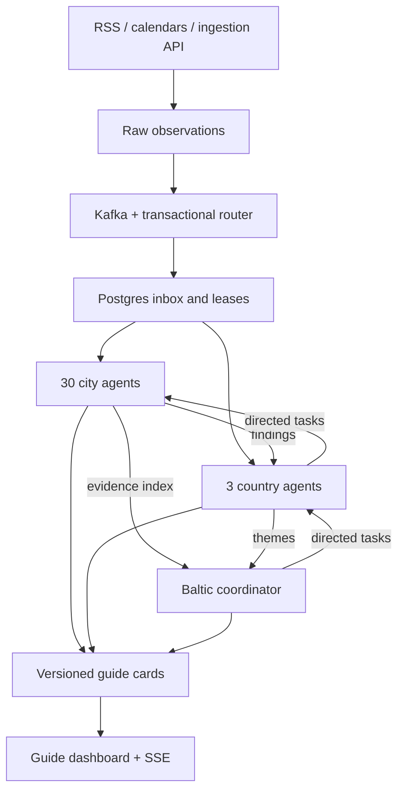

# Architecture

## Roster and topic contract

Country codes are `lv`, `ee`, `lt`. City IDs are `{country}:{slug}`; agent IDs are `city:{country}:{slug}`. City topic names are `baltic.city.{country}.{slug}.events.v1`.

| Country | City slugs |
|---|---|
| Latvia | riga, daugavpils, liepaja, jelgava, jurmala, ventspils, rezekne, valmiera, ogre, jekabpils |
| Estonia | tallinn, tartu, narva, parnu, kohtla-jarve, viljandi, maardu, rakvere, kuressaare, sillamae |
| Lithuania | vilnius, kaunas, klaipeda, siauliai, panevezys, alytus, marijampole, mazeikiai, jonava, utena |

The roster is explicit in `backend/baltic/registry.py`; the order is not a population rank. Boundary/date validation against official statistical extracts remains an operator prerequisite if the product must guarantee a specific year's “ten largest” ranking. Stable IDs should survive later rank changes.

| Topic | Content |
|---|---|
| `baltic.ingest.raw.v1` | Validated observation, source identity, dates, city applicability, evidence URL |
| `baltic.city.{country}.{slug}.events.v1` | Canonical entity ID and version reference |
| `baltic.country.{country}.events.v1` | National observation references |
| `baltic.city.findings.v1` | Versioned city findings; fanned to parent and coordinator |
| `baltic.country.findings.v1` | Versioned country themes; wakes coordinator |
| `baltic.guide.messages.v1` | Findings eligible for guide-specific delivery |
| `baltic.agent.health.v1` | Reserved health topic; current health is persisted in Postgres |
| `baltic.deadletter.v1` | Malformed input metadata |

These are topics created in your Kafka cluster, not public feeds. One partition per topic and 14-day broker retention are the bootstrap defaults. Existing topic configuration is not overwritten. The normalizer is serialized with a Postgres advisory lock; topic assignment never determines an agent's identity.

## Durable processing

1. An adapter/API stores an observation in a transactional outbox.
2. The outbox publishes to Kafka with a stable event ID. The consumer writes evidence/canonical facts and further routing events atomically.
3. A city or country record becomes a durable inbox entry before its Kafka offset is committed. Records are processed sequentially in the consumer; failed persistence prevents advancement past that record.
4. A warm worker claims an agent lease (90 seconds), selects a prioritized inbox job, and runs its LangGraph in a worker thread. The event loop continues Kafka polling and lease renewal.
5. Completion checks the lease token and evidence versions, then commits memory, findings, result messages, and inbox completion atomically. A stale worker cannot commit over its replacement.
6. Replayed outputs have stable IDs/fingerprints. The outbox and notification tables absorb duplicates; replay mode suppresses user alerts.

Delivery is at least once. Inference can be repeated after a crash. LangGraph checkpoints retain per-job execution state, while this implementation retries the bounded workflow from its input and relies on fenced/idempotent commits. It does not claim end-to-end exactly-once model execution.

City/country/Baltic jobs share workers, with a per-agent lease and fairness based on last-run time. Cancellations receive higher inbox priority. A saturated worker pool can still delay a city; keep warm capacity and measure backlog. Worker idle polling is 200 ms, outbox idle polling 100 ms. Those are implementation intervals, not an end-to-end latency guarantee.

## Heartbeats and memory

Lease renewal runs during active execution. Process health is written at most every 15 seconds; the scheduler wakes every 30 seconds. Deterministic maintenance jobs recur every 15 minutes (city), 30 minutes (country), and hour (coordinator). They expire elapsed events and recompute themes. Unchanged snapshots avoid model calls.

Memory comprises current facts, immutable ingested evidence assertions, bounded recent titles, snapshot version, counts, and optional model assessment. The raw publisher page is not mirrored; adapters retain the permitted excerpt and structured fields they extract. Current canonical facts are versioned but historical versions are reconstructed from retained evidence, not a separate fact-history table.

News mentions are relevance hints. Their city cards explicitly qualify local applicability. Only confirmed `kind=event` observations with known dates and locations can support event themes. Distinct canonical entities count once; syndication is merged where canonical URL or supplied identity identifies it. Different translations without a shared identity are not automatically guaranteed to merge.

Country themes require three covered cities; Baltic themes require two countries. Date intervals must overlap. Conflict-marked facts are excluded. Themes are revised/retracted when support changes, and prior recipients receive corrections even if their preferences subsequently changed.

## Agent communication and guide delivery

The official A2A SDK 1.1.5 serves the pinned A2A 1.0 HTTP contract under `/a2a/{agent_id}`. Directed requests persist into the same task/inbox tables as guide questions. Colocated parent/child delegation uses validated protobuf A2A messages and the durable task bridge; it does not make unnecessary HTTP calls between processes. External agents use the advertised JSON-RPC/REST interfaces. Kafka findings are application domain events, not an invented A2A-over-Kafka standard.

Delegation follows the fixed tree, maximum depth two, maximum 33 child tasks from the coordinator. Parent execution waits for children; cancellation traverses descendants. Tasks and messages are owner-scoped. Tourism facts are shared across guides. Internal service ownership is assigned by the gateway, never trusted from arbitrary request metadata.

Guides receive durable, per-owner sequence-numbered cards. SSE reconnects with a cursor; acknowledgments and saved state persist separately. Notification writes are serialized in Postgres so a later committed cursor cannot hide an earlier uncommitted notification. Structured artifacts carry source URLs/evidence references, affected places, status, version, dates, and recommended actions.
