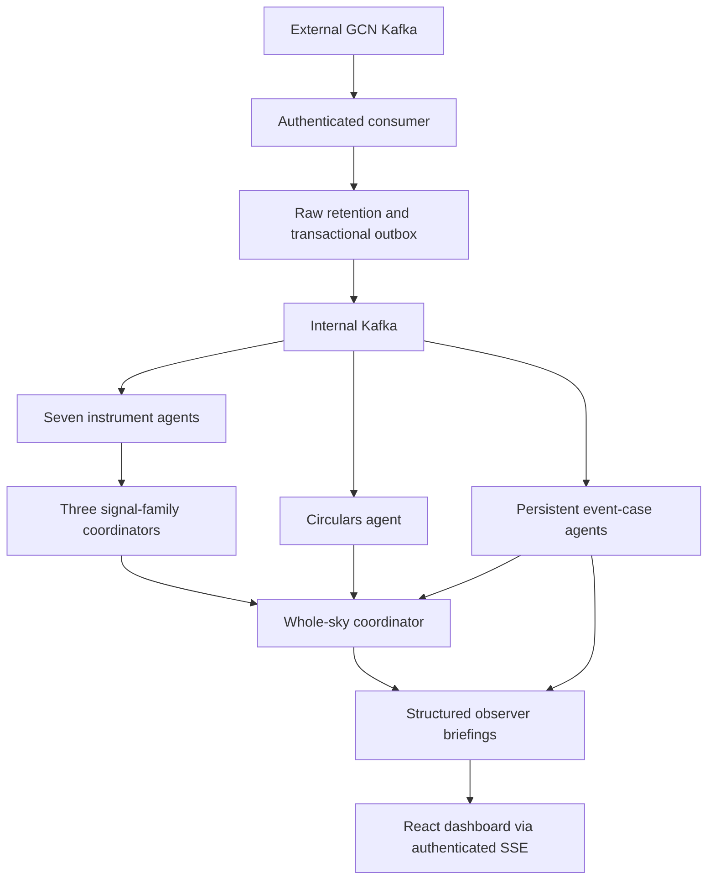

# Architecture

External Kafka subscriptions are configured in `registry.py`. The internal broker has one inbox topic per permanent agent plus raw, findings, cases, observer messages, and dead-letter topics. No application topics are created on NASA's broker.

## Delivery and execution

1. The external consumer authenticates through GCN OAuth using server-side client credentials.
2. For each record it retains topic, partition, offset, and the original payload in PostgreSQL and emits the parsed observation through an outbox in the same transaction. Unparseable records go to quarantine.
3. Only after that transaction commits does it commit the external Kafka offset. A database failure causes reconnect from the committed offset; it cannot skip a record.
4. Internal Kafka consumers insert inbox jobs transactionally before committing internal offsets. Identifiers deduplicate re-deliveries.
5. Workers acquire expiring per-agent leases. Inference happens outside the lease transaction; leases are renewed, and output writes verify the fencing token and fact versions. A crashed worker's job is reclaimed.
6. Agent memory, findings, tasks, and outgoing events commit together. Outbox retries are idempotent; delivery is at-least-once, not a claim of distributed exactly-once processing.
7. A heartbeat schedules bounded evidence checks without continuously running model sessions. Workers check durable inboxes every 100 ms when idle. End-to-end response time also includes broker delivery, queues, database work, and optional inference.

The workflow is LangGraph: load evidence, assess changes, validate evidence references. Model text is labeled as interpretation and cannot replace authoritative source status, measurements, or evidence references. Daily model budget reservations are conservative; unused reserved capacity is not refunded.

## Agent composition

Instrument agents report to their messenger-family parent. Family agents report to the whole-sky coordinator. Circulars and event cases also report to the coordinator. Parents load child findings; directed verification requests generate A2A-typed child tasks with parent links, durable status, and bounded two-level delegation. External callers use authenticated A2A JSON-RPC/REST; same-process delegation uses the same typed contract without a loopback HTTP hop.

Event-case agents are persistent logical entities executed by the shared worker pool. They do not each require a container or model process. The permanent agents have discoverable A2A interfaces; dynamic cases are queried through `/api/tasks` with their agent ID.

## Scientific boundaries

- Cases group explicit source identifiers. They are evidence dossiers, not a catalog of confirmed astrophysical objects. A report can reference multiple cases without those cases being merged.
- Shared Swift mission trigger numbers group BAT, XRT, and UVOT reports. Instrument-specific Fermi identifiers remain distinct unless a report explicitly supplies a reference.
- IceCube LVK searches link by `ref_ID` and retain `reference`, including the source map revision. A follow-up search is not automatically a positive detection.
- Circulars are attached using exact event/trigger references. Their human-written claims and any model interpretation remain separate from notice status; prose alone does not retract a machine-readable detection.
- No automatic angular-distance matching, guessed HEALPix overlap, invented p-values, or promotion to confirmed multi-messenger discovery.
- LVK sky-map contents remain in the raw payload; the app does not compute probability contours. IceCube map references and source probabilities remain in the structured metadata.
- Test/injection events and LVK mock identifiers are retained but excluded from live findings and observer messages.
- Older source revisions remain in history but cannot overwrite the current source record. Retractions update case briefings and reach observers who received the earlier version even if preferences changed.

Permanent-agent automatic summaries cover the preceding 24 hours of received updates. Query/case evidence is bounded to the most recent 500 matching reports for a run; model context uses up to 30 reports and 12 child findings. The case detail API provides current reports and the most recent 200 history records. These are explicit working-context bounds, not claims of exhaustive scientific analysis.

## Existing installation upgrade

All application tables use the `obs_` prefix, and Compose uses new `observatory-*` volumes. The previous tourist data is not reinterpreted as astronomy data and is not automatically deleted. Stop the old stack before starting this one to release port 8000. Keep old volumes until their data is no longer needed. Initial schema creation is transactional under a PostgreSQL advisory lock; future schema changes require an explicit versioned migration.
